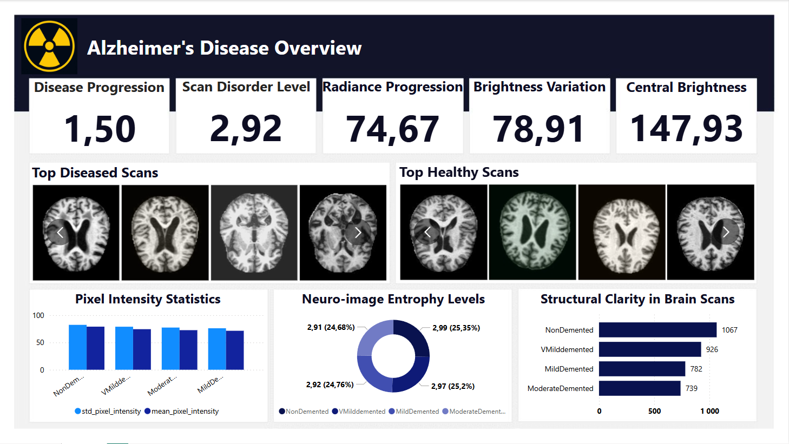

# 🧠 MRI Brain Scan Analysis with Python & Power BI

In this project, I developed a complete data analysis pipeline that transforms raw MRI brain scan images into a structured dataset and a dynamic Power BI dashboard. The goal was to extract meaningful features from MRI images related to Alzheimer’s disease and visualize patterns across different dementia stages.

---

## 📌 Project Overview

- I worked with multiclass MRI datasets containing images labeled as:
  - 'NonDemented'
  - 'VeryMildDemented'
  - 'MildDemented'
  - 'ModerateDemented'

- The raw image data was originally provided in `.zip` format and processed directly (without manual extraction) using Python.

- I extracted key image-based features such as:
  - Mean pixel intensity  
  - Pixel standard deviation  
  - Shannon entropy  
  - Edge density (via Sobel filter)  
  - Center brightness  

- Each image was labeled and standardized (e.g., prefix naming, augmentation detection), and the processed data was saved to a clean `.csv` file.

- The dataset was then used to build an interactive dashboard in **Power BI**, allowing for detailed analysis of feature distributions and class imbalances across dementia severity.

---

## 🧪 Technologies Used

- **Python** – Data preprocessing and feature engineering:
  - PIL, NumPy, Pandas, skimage, tqdm, os
- **Power BI** – Interactive medical dashboard with patient-level insights
- **Excel** (optional) – Previewing and cleaning outputs

---

## 📁 Datasets

- [Kaggle: Augmented Alzheimer MRI Dataset](https://www.kaggle.com/datasets/uraninjo/augmented-alzheimer-mri-dataset)
- [Kaggle: Multiclass Alzheimer Dataset (equal & augmented)](https://www.kaggle.com/datasets/aryansinghal10/alzheimers-multiclass-dataset-equal-and-augmented)

---

## 📈 Dashboard Highlights

The Power BI dashboard includes:

- Class-wise breakdown of image counts  
- Feature comparison between different dementia stages  
- Augmentation detection summary  
- Filters to drill down into specific groups or image types  

The dashboard is fully interactive and built with storytelling in mind — suitable for presenting insights to both technical and non-technical stakeholders in the healthcare domain.

---

## 🎯 Purpose

This project demonstrates my ability to combine image processing, data engineering, and visual storytelling in a healthcare context. It highlights skills in:

- Working with medical imaging data
- Building structured datasets from unstructured sources
- Designing clear, actionable visualizations in Power BI
- Bridging Python and BI tools in real-world applications

---

## 📸 Preview

